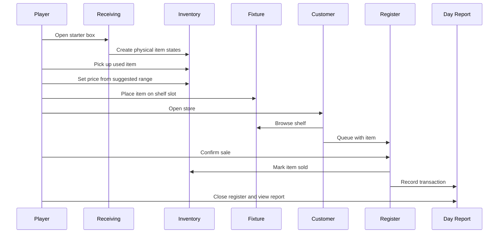

# Core Loop And Systems

## Core Loop

The game loop is:

1. Prepare the store.
2. Open to customers.
3. Sell, advise, and react.
4. Close the day.
5. Read what happened.
6. Order, reorganize, or hold back.
7. Start the next day with consequences.

The first playable implements only a narrow version of this loop, but all code should respect this structure.

## Day Phases

### Prep

The player has full control and no customer pressure.

Allowed:

- receive stock
- inspect boxes
- pick up items
- price used goods
- stock shelves
- move fixtures
- use backroom computer
- save

### Open

The store accepts customers.

Allowed:

- sell goods
- continue stocking if feasible
- help customers
- use register
- inspect stock
- basic management

Open hours should eventually be timed. For the first playable, a short controlled customer wave is acceptable.

### Closing

The store stops accepting new customers but current customers resolve.

Allowed:

- complete active sales
- wait for browsing customers to leave
- restock if desired
- close register once floor is clear

### Report

The game turns activity into decisions.

Required first playable report:

- starting cash
- ending cash
- revenue
- cost basis
- gross margin
- items sold
- items remaining
- basic shelf warning

Later report additions:

- reputation movement
- supplier notes
- launch warnings
- returns/services
- records integrity

## System Boundaries

### Inventory

Owns physical stock identity and item state.

It should know:

- what item exists
- where it is
- whether it is sellable
- how it is priced
- whether it has been sold

### Fixtures

Owns physical placement capacity.

It should know:

- valid slots
- accepted categories
- current item ids
- whether it is full
- whether customers can browse it

### Customers

Owns customer intent and movement.

It should know:

- archetype
- patience
- interest
- target item/category
- current behavior state
- selected item if any

### Register

Owns transaction completion.

It should know:

- active customer
- selected item
- price
- confirmation state
- transaction output

### Report

Owns day summary.

It should not duplicate gameplay logic. It should read recorded events and summarize them.

### Save

Owns persistence.

It should preserve the store, not just high-level stats.

## First-Slice Event Flow

## Design Rule

Every system should answer:

> What did this teach the player about running the store?

If the answer is only "it added content," the system is probably not ready.

