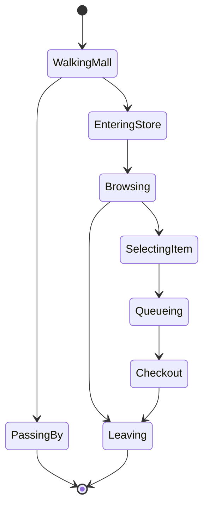

# Customers And Day Flow

## Customer Philosophy

Customers are the proof that the store works.

They should not be only UI rows. Even in the first playable, customers should physically appear from the mall, decide whether to enter, browse, queue, buy, or leave.

## Mall Spawn Model

The mall should have at least two offscreen path directions:

- left concourse spawn
- right concourse spawn

Customers spawn outside the store and walk through the mall concourse. Some enter; some pass by.

This matters because the store should feel like part of a mall, not an isolated box.

## First Playable Customer Archetypes

### Browser

Purpose:

- tests shelf attractiveness and price reasonableness

Behavior:

- enters if store is open and attraction check passes
- browses one or more shelves
- may buy an item if price and interest align
- may leave without buying

### Target Buyer

Purpose:

- tests whether stocked items are findable

Behavior:

- enters with a desired product/category/platform
- looks for matching shelf
- buys if item is available and acceptable
- leaves disappointed if not found

### Parent Gift Buyer, Optional

Purpose:

- tests recommendation and category clarity

First playable can skip this if it would require too much UI.

## Customer State Machine

## Enter Decision

First playable simple inputs:

- store is open
- storefront path is accessible
- visible shelf has stock
- customer archetype interest
- random variation

Later inputs:

- reputation
- signage
- product mix
- launch day
- customer memory
- store quality

## Browse Decision

Customers should evaluate:

- matching product/category
- price acceptability
- shelf visibility
- available stock

First playable does not need sophisticated behavior. It needs believable behavior.

## Queue Rules

First playable:

- customers with selected items queue at register
- register handles one customer at a time
- queue order is first-in, first-out
- customer waits long enough for player to react

Later:

- patience changes by archetype
- return/service/preorder queue priority
- customer frustration affects reputation

## Customer Feedback

Use concise physical feedback:

- looks at shelf
- picks up item
- walks to register
- idle/turns while waiting
- leaves with or without bag/item

Avoid making every customer explain the rules through dialogue.

## Day Flow For First Playable

The first playable can use a controlled short day:

1. player opens store
2. first customer wave begins
3. 3-5 customers spawn
4. at least one customer should be likely to buy if shelves are stocked reasonably
5. wave ends
6. no new customers enter
7. player closes register

This controlled approach is acceptable until broader traffic simulation exists.

