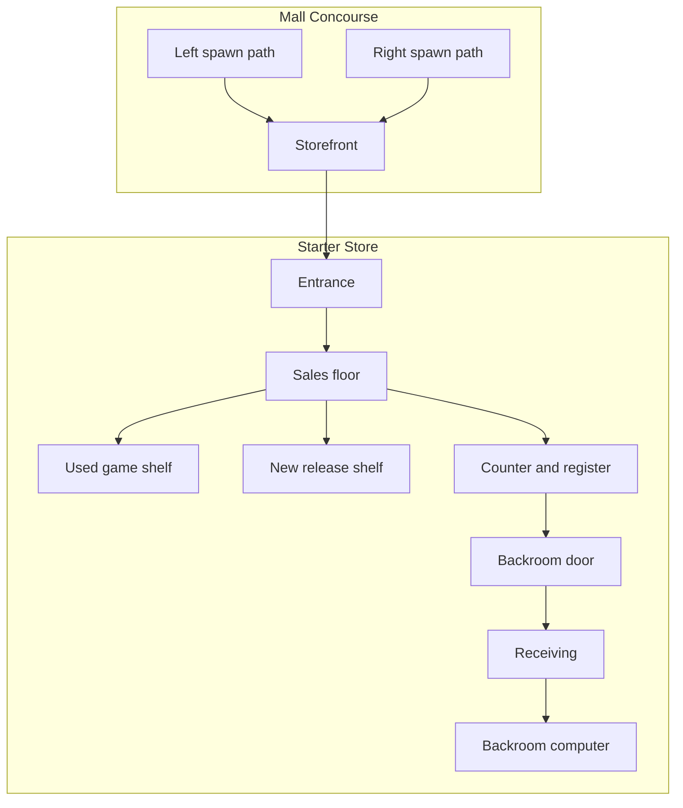

# Store Layout And Customization

## Layout Philosophy

The player should shape the store immediately. Even the first playable should let the player move at least one fixture and see that the store is theirs.

Customization is not decoration only. It affects:

- customer navigation
- browse visibility
- stocking efficiency
- counter readability
- store identity

## First Store

The first store is a mall unit.

Required spaces:

- glass storefront
- entrance
- starter sales floor
- checkout counter
- receiving/backroom
- backroom computer
- mall concourse outside
- two mall path directions for customer spawns

## High-Level Floor Plan

## Immediate Customization

First playable must support:

- moving at least one sales fixture
- rotating it
- placing it on valid floor
- seeing invalid placement
- saving fixture placement

Recommended controls:

- enter layout mode from a tool or key
- aim at fixture
- select fixture
- ghost preview while moving
- rotate in fixed increments
- confirm placement
- cancel placement

## Placement Constraints

Fixture placement must protect:

- storefront entrance
- backroom door
- counter access
- minimum customer path width
- no overlap with walls
- no overlap with other fixtures

If path validation is expensive, first playable can use simple blocked zones plus a later navigation pass.

## Customer Navigation

Customers must understand:

- how to enter
- how to reach browsable fixtures
- how to reach the register
- how to exit

The layout system should expose fixture browse points to customer AI.

## Store Identity Through Layout

Later store identities should map to layout choices:

- Straight Shot: counter visible from entrance, efficient sales flow.
- Browse Loop: shelves route customers through product exposure.
- Split Shop: new stock and used/service stock have separate zones.
- Backroom-Forward: operational speed and receiving dominate.
- Boutique Compact: controlled stock and premium sightlines.

The first playable should not implement all identities, but it should not block them.

## Environmental Elements

First playable:

- walls
- storefront glass
- ceiling lights
- floor material
- checkout counter
- shelves/racks
- receiving box
- open/closed sign

Later:

- carpet colors
- wall paint
- posters
- platform headers
- price tag styles
- display cases
- demo kiosk
- service bench
- mall-facing props

## Design Warning

Do not use customization to hide weak core systems. The first shelf, first box, first customer path, and first sale must work before cosmetic breadth expands.

