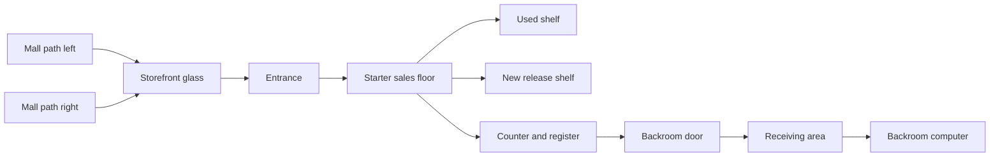

# Game Store Sim Source Master Plan

This is the primary production reference for Game Store Sim. When implementation starts, this document should remain the first file engineers, designers, artists, and testers read.

The purpose of this plan is to turn the current game-guide canon and inspiration folders into an implementation-ready first playable without losing the larger game fantasy.

## 1. Product Thesis

Game Store Sim is a first-person retail life sim about operating one believable independent game store in an early-2000s mall.

The game is not about becoming a giant chain, collecting real-world brands, or solving a separate mystery campaign. It is about touching the daily work of a small game shop:

- receiving stock
- checking invoices
- pricing used goods
- stocking visible shelves
- helping customers
- keeping launch promises
- handling returns and services
- ordering from suppliers
- reading daily reports
- deciding what kind of store this is becoming

The long-term fantasy is:

> I opened this place myself. Every shelf tells me what I chose, what I missed, and what I am trying to become.

## 2. Non-Negotiable Direction

These are locked until intentionally changed through a decision doc:

- Setting: mall storefront.
- View: first-person.
- Initial platform: macOS.
- Initial gameplay scope: 0.0%-0.3% first playable.
- Tone: warm nostalgia, grounded retail, lightly idealized but not sterile.
- IP policy: all brands, platforms, products, games, publishers, distributors, and store names are fictional.
- Inventory model: one physical stock item equals one actual in-game object.
- Customer model: customers are physically present NPCs who spawn from mall paths, may enter, browse, queue, buy, or leave.
- Pricing model: suggested pricing for used goods; new goods use fixed contract pricing while considered new.
- Layout model: customization is available immediately.
- Documentation model: Markdown in repo is the production source of truth.

## 3. Source Of Truth Order

Use these sources in this order when a conflict appears:

1. `docs/MASTER_PLAN.md` for current production direction.
2. `docs/06-decisions/*.md` for explicit decisions.
3. `docs/01-design/*.md` for buildable game rules.
4. `docs/02-technical/*.md` for implementation architecture.
5. `game-guide/` for player-facing canon and long-range design validation.
6. `real_inspiration/` and `other_game_inspiration/` for extracted reference patterns.

The `game-guide/` folder should remain valuable. It is allowed to be wrong or incomplete, but changes to its assumptions should be deliberate. Do not silently implement against it and then drift away.

## 4. First Playable Definition

The first playable covers 0.0%-0.3% completion only.

It must prove the core retail language:

1. Player enters the mall storefront before opening.
2. Starter shipment exists in receiving/backroom.
3. Player opens shipment and sees physical items.
4. Each stock item is a physical object that can be picked up.
5. Used items can be priced using suggested pricing.
6. New items have fixed prices while considered new.
7. Player stocks physical items onto shelves/racks/counter fixtures.
8. Store can be opened.
9. Customers spawn from mall paths and decide whether to enter.
10. Entering customers browse, react to products/prices, queue, or leave.
11. Player completes one or more sales at the register.
12. Player closes the register after customer flow ends.
13. Daily report summarizes what happened.
14. Save/load restores the store state.

Anything outside that list is optional for later.

## 5. Scope Guardrails

Do not build these in the first playable:

- full supplier network
- neighboring-unit expansion
- employees
- deep services
- returns
- trade-ins, unless a later milestone explicitly pulls them forward
- rare-game economy
- full secret web
- court/arrest/inspection outcomes
- multi-year progression
- complete launch calendar
- online multiplayer
- real-world game/platform references

It is acceptable to include one harmless odd detail in the starter shipment as atmosphere, but it must not trigger a secret quest, failure condition, or required investigation.

## 6. Design Pillars

### Physical Retail

The store should be understood by walking through it. The player learns by handling inventory, seeing shelf gaps, reading price stickers, and watching customer behavior.

### One Item, One Object

Ten copies of a game are ten physical stock items. They may be represented with optimized meshes, grouped shelf visuals, or batched rendering, but the simulation must preserve item identity.

### Consequences Over Exposition

The game should not constantly explain its rules through tutorial panels. It should show consequences:

- overpriced stock sits
- fair prices move
- bad layout slows customers
- empty shelves create missed demand
- clean records reduce risk later
- ignored reports lead to weak planning

### Warm Nostalgia

The store should feel specific to early-2000s retail without copying real businesses. Think fluorescent lights, commercial carpet, plastic cases, cardboard boxes, yellow sale stickers, wire-grid shelves, platform headers, mall concourse sounds, and posters that feel time-bound without using real IP.

### Business First, Mystery Second

The secret web exists because retail work produces records, anomalies, and pressure. It does not sit outside the store loop.

## 7. Long-Term Game Shape

The full game should grow through these bands:

| Band | Player Meaning | Main Systems |
| --- | --- | --- |
| 0.0%-0.3% | Tutorial opening | receiving, pricing, stocking, first sale, first close |
| 0.3%-1% | First week | more sales, first supplier order, early report reading |
| 1%-3% | Survival store | returns/services begin, stock planning matters |
| 3%-5% | Early local shop | regulars, recommendations, basic customer memory |
| 5%-10% | Month-one shop | launch calendar, preorders, first meaningful supplier choice |
| 10%-20% | Stable first-era business | store identity, fixture choices, deeper product mix |
| 20%-35% | Recognized local store | catalog expansion, stronger repeat customers |
| 35%-50% | Mature first-era store | launch competence, broad stocked categories |
| 50%-65% | Era transition | new fictional platform generation pressure |
| 65%-80% | Destination shop | rare demand, neighboring-unit expansion |
| 80%-95% | Store legacy | mature identity, long-term records |
| 95%-100% | Completion and replay | ending families, secret route comparisons |

## 8. Engine Direction

Godot 4 is the default recommendation because it supports desktop-first 3D, has readable project structure, exports to macOS, and keeps development lightweight.

This is not a permanent lock. The engine decision remains open until a prototype proves:

- first-person movement feels right
- physical item pickup/placement is stable
- dense shelves are performant on Mac
- UI overlays and management screens are efficient to build
- macOS export workflow is acceptable
- validation can be automated locally

See [Engine Evaluation](02-technical/engine-evaluation.md).

## 9. First Technical Architecture

The first implementation should use explicit systems instead of clever generality.

Recommended major systems:

- `GameState`: current save state and top-level access.
- `StoreDayManager`: prep/open/closed day phases.
- `InventoryManager`: item identity, ownership, locations, prices.
- `FixtureManager`: valid slots, shelf capacity, display state.
- `CustomerDirector`: mall spawn paths, enter decisions, customer flow.
- `RegisterSystem`: sale flow and transaction recording.
- `ReportSystem`: daily summary generation.
- `SaveSystem`: save/load serialization.
- `InteractionController`: raycast targeting, pickup/carry/place.
- `LayoutEditSystem`: immediate fixture movement and placement.

The architecture should make systems testable before the final art exists.

## 10. First Store Layout

The first store is a small mall unit with:

- glass storefront facing concourse
- one visible customer entrance
- two offscreen mall spawn directions
- starter sales floor
- checkout counter
- receiving/backroom
- backroom computer
- starter shelves/racks
- at least one movable fixture
- open/closed sign

High-level layout:

## 11. Art Direction Summary

The art direction is a hybrid of:

- grounded early-2000s retail reference from `real_inspiration/`
- readable, slightly stylized simulator presentation from `other_game_inspiration/`

Target:

- clear silhouettes
- bright retail lighting
- slightly chunky, readable props
- dense product rows where it matters
- warm, inviting nostalgia
- no photorealistic clutter soup

Do not copy real packaging, logos, platform names, storefronts, or game art.

## 12. Documentation Set

The initial documentation pack contains:

- [Product Brief](00-product/product-brief.md)
- [Source Policy](05-reference/source-of-truth-policy.md)
- [Vertical Slice Contract](01-design/vertical-slice-contract.md)
- [Core Loop And Systems](01-design/core-loop-and-systems.md)
- [Inventory, Pricing, And Fixtures](01-design/inventory-pricing-and-fixtures.md)
- [Store Layout And Customization](01-design/store-layout-and-customization.md)
- [Customers And Day Flow](01-design/customers-and-day-flow.md)
- [Art Direction](01-design/art-direction.md)
- [Engine Evaluation](02-technical/engine-evaluation.md)
- [Technical Architecture](02-technical/architecture.md)
- [Data Model](02-technical/data-model.md)
- [macOS Build Requirements](02-technical/macos-build-requirements.md)
- [Milestones And Backlog](03-production/milestones-and-backlog.md)
- [Definition Of Done](03-production/definition-of-done.md)
- [Local Validation Plan](04-validation/local-validation-plan.md)
- [Manual Playtest Checklist](04-validation/manual-playtest-checklist.md)
- [Inspiration Extraction](05-reference/inspiration-extraction.md)
- decision records in `docs/06-decisions/`

## 13. Working Agreement

Before writing first gameplay code:

1. Resolve the engine decision enough to create the project.
2. Confirm the first playable store layout.
3. Confirm the initial fictional platform/product naming scheme.
4. Confirm the first customer archetypes.
5. Confirm validation gate expectations.
6. Create the engine project.
7. Add the validation harness before the slice grows.

No code should be considered done without a matching validation path.

